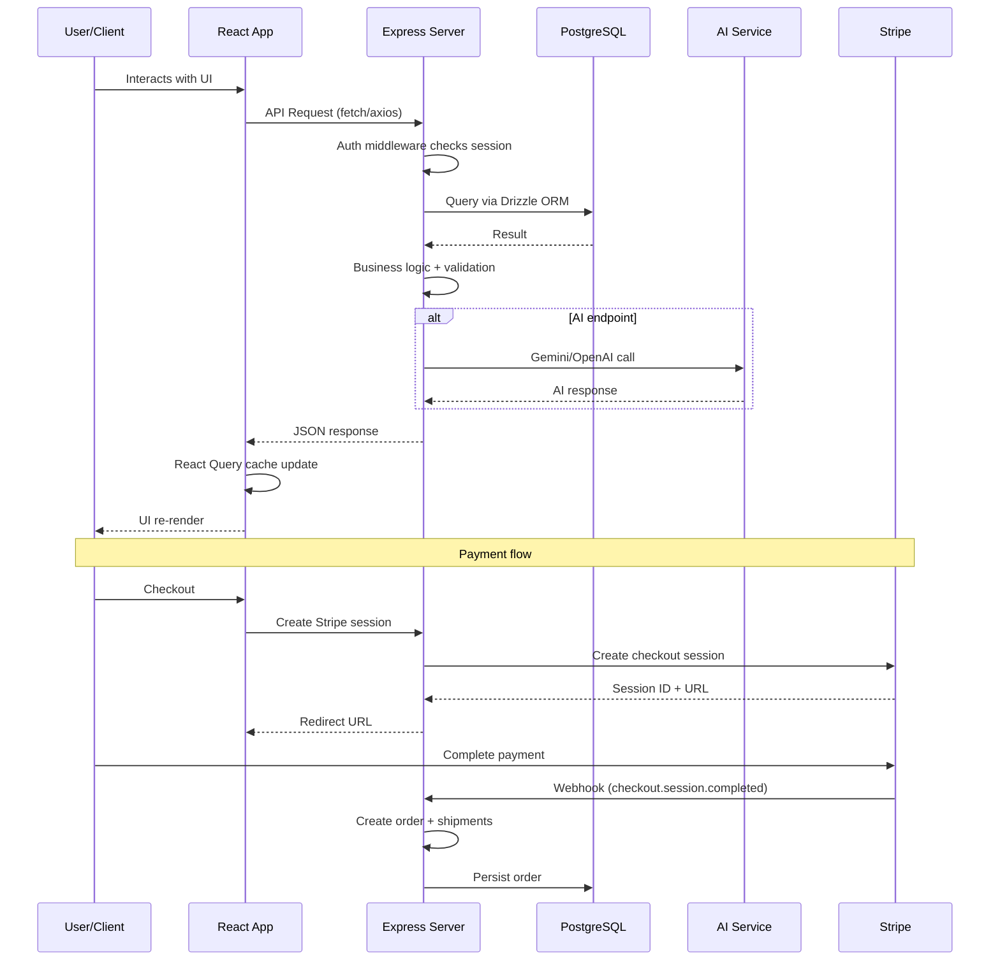

# AgriConnect

**A full-stack agricultural marketplace connecting local farmers directly with buyers — powered by AI, voice, and real-time logistics.**


> **Status:** Actively under development — core features functional, expanding modules regularly.

---

## Overview

AgriConnect is a marketplace and knowledge platform built for the agricultural community. It connects people who grow food with people who buy food — eliminating middlemen, reducing waste, and ensuring fair prices.

### The Problem

- Farmers struggle to reach buyers directly and lose margins to intermediaries.
- Buyers want fresh, verified produce but have limited local options.
- Agricultural logistics are fragmented — cold chain, route optimization, and last-mile delivery are expensive and opaque.
- Government farming schemes and subsidies are hard to find and apply for.

### The Solution

AgriConnect provides:

- A **marketplace** where farmers list products and buyers purchase directly.
- **AI-powered tools** — voice commands, smart search, photo-to-listing, and a conversational assistant.
- **Real-time logistics** — integrated shipping with 9 carriers, cold-chain support, and milk-run route optimization.
- **Land leasing** — a marketplace for agricultural land rental, sale, investment, and community plots.
- **Knowledge hub** — government schemes, agronomy guidance, and expert connections.
- **Share & Care** — food rescue to reduce waste and feed communities.

### Vision

Build the operating system for modern agriculture — from seed to sale, from soil to table.

---

## Key Features

### Authentication

- **Replit OIDC** — OpenID Connect via Passport.js with automatic token refresh.
- **Session management** — PostgreSQL-backed sessions with 1-week TTL.
- **Guest cart** — Anonymous session-based cart that merges on first login.
- **Profile wizard** — Onboarding flow for role selection (buyer/farmer) and profile setup.
- **Protected routes** — `isAuthenticated` middleware guards all sensitive endpoints.

### Marketplace

- **Product listings** — Farmers create products with images, descriptions, pricing, dietary tags, and organic certification.
- **Category browsing** — Hierarchical categories (Daily, Inputs, Processed, Specialty, Dietary, etc.) with subcategories.
- **Product cards** — Display price, stock status, organic badge, farmer info, rating, and add-to-cart button.
- **Product comparison** — Compare up to 4 products side-by-side on specs, price, and rating.
- **Product filters** — Sort by newest, price, rating, distance; filter by distance radius, rating threshold, organic-only, and in-stock.
- **Product detail** — Full product page with images, description, reviews, subscription options, and farmer profile link.

### AI-Powered Search

- **Smart query expansion** — AI corrects typos ("tomatos" → "tomatoes") and expands vague queries ("vegys from local farm" → "organic vegetables from local farmers near [location]").
- **Fuzzy matching** — Levenshtein distance-based fallback when AI is unavailable.
- **Category inference** — AI suggests relevant categories from natural language queries.
- **Toggle control** — Users can switch between AI-enhanced and standard keyword search.

### Conversational Voice Assistant

- **Voice commands** — "Find organic tomatoes", "Go to dashboard", "Open cart", "Sell my produce".
- **Multi-turn conversation** — Maintains chat history (last 10 turns) for contextual follow-up questions.
- **Chat bubble UI** — Visual conversation display with user/AI role labels.
- **Audio cues** — Optional sound feedback on actions.
- **Continuous mode** — Stays listening for follow-up commands.

### AI Chat Assistant

- **Floating widget** — Always-accessible AI assistant in the bottom-right corner.
- **Context-aware** — System prompt includes live product catalog and categories.
- **Suggested questions** — Pre-built quick actions for common queries.
- **Error handling** — Graceful fallback for auth errors, rate limits, and network failures.

### Photo-to-Listing (AI)

- **Camera capture** — Take a photo of produce directly in the app.
- **AI identification** — Detects product name, category, quality grade, and suggests a price.
- **One-click listing** — Auto-populates product form from AI analysis.

### Shopping Cart & Checkout

- **Guest + authenticated cart** — Works without login, merges on authentication.
- **Subscription support** — Weekly, bi-weekly, or monthly recurring orders.
- **Bulk discount** — Volume-based pricing tiers.
- **Multi-step checkout** — Cart review → Shipping selection → Payment → Confirmation.
- **Per-farmer shipping** — Separate shipping quotes and carrier selection per farmer in the order.
- **Server-authoritative pricing** — Prices re-verified from database at checkout (tamper-proof).

### Stripe Payments

- **Stripe Checkout** — Redirect-based payment flow with server-side session creation.
- **Line items** — Products + express delivery + per-parcel carrier shipping + 20% VAT.
- **Webhooks** — `checkout.session.completed` triggers order confirmation + auto shipment creation.
- **Refunds** — Full refund on order cancellation with idempotency keys.
- **Abandoned order cleanup** — Orders pending >30 minutes are automatically cancelled.

### Shipping & Logistics

- **9 carrier rate cards** — Royal Mail, Evri, DPD Local, UPS, FedEx, DHL, Stuart, AgriConnect Cold-Chain, Farmer Milk Run.
- **Quote engine** — `baseFare + (perKm × distance) + (perKg × weight)` with cold-chain, fragile, and international surcharges.
- **Distance calculation** — Haversine formula using geocoded postcode/coordinate centroids.
- **CO₂ tracking** — Per-kg-per-km emission factor per carrier.
- **Milk run routes** — Shared delivery routes that combine multiple farm pickups into optimized paths, reducing costs by 60-70%.
- **Carrier adapters** — Pluggable adapter pattern for Royal Mail, DPD, and mock adapters for others.
- **Auto-shipment** — On Stripe payment success, shipments are automatically created per farmer.
- **Tracking timeline** — Public tracking page with status events, location, and timestamps.
- **Notifications** — Email (SendGrid) and WhatsApp (Meta Cloud API) on shipment booking.

### Interactive Map

- **Leaflet integration** — Full interactive map with OpenStreetMap tiles.
- **Farmer markers** — Color-coded markers showing online status and stock levels.
- **Tile layers** — Standard, satellite, terrain, and hybrid views.
- **Map overlays** — Toggle farmer markers, demand indicators, and heatmap.
- **Land plot drawing** — Polygon, rectangle, and circle drawing tools for land listings.
- **Nearby sellers** — Find farmers within a radius with distance-sorted results.
- **Split view** — Map alongside product/farmer listings.

### Land Leasing Marketplace

- **Lease listings** — Agricultural land available for short-term or long-term rental.
- **For sale** — Permanent land purchase listings.
- **Investment** — Agricultural land investment opportunities with projected returns.
- **Community plots** — Shared farming spaces, allotments, and community gardens.
- **Government programs** — Subsidized land access through government schemes.
- **My leases** — Track active leases, payments, and activity logs.

### Share & Care (Food Rescue)

- **Surplus food listing** — Restaurants and homes list surplus food with expiry timers.
- **Urgency levels** — Urgent (<1h), medium (1-3h), safe (3+ hours).
- **NGO dashboard** — Track meals served, food rescued, CO₂ saved.
- **Rescue leaderboard** — Community gamification for waste reduction.
- **Safety rules** — Food safety commitment and temperature handling guidelines.

### Government Schemes

- **Scheme catalog** — Browse available agricultural subsidies, insurance, and financial support.
- **Application submission** — Apply directly through the platform with document upload.
- **Application tracking** — Monitor status of submitted applications.

### Dashboard

- **Overview** — Quick stats on orders, revenue, and activity.
- **Quick actions** — Withdrawal, delivery arrangement, demand acceptance.
- **Activity feed** — Recent orders, messages, and system events.
- **Farmer stats** — Sales, ratings, and performance metrics.

### Internationalization (i18n)

- **6 languages** — English, Hindi (हिन्दी), Punjabi (ਪੰਜਾਬੀ), Tamil (தமிழ்), Welsh (Cymraeg), Polish (Polski).
- **1,550+ translation keys** — Every visible text in the application changes with language selection.
- **61 content sections** — Navigation, categories, search, products, cart, checkout, orders, dashboard, settings, help, land, logistics, share & care, about, support, AI chat, maps, and more.
- **Auto-translate DOM walker** — Optional runtime translation for dynamic content via AI.
- **Language detection** — Browser language detection with localStorage persistence.
- **Architecture** — `i18next` + `react-i18next` + JSON locale files.

### Dark Mode & Theming

- **Three themes** — Light, Dark, and System (follows OS preference).
- **Smooth transitions** — Crossfade overlay animation when switching themes.
- **Persistent** — Theme choice saved in localStorage.
- **Class-based** — Tailwind CSS dark mode via `dark:` class strategy.

### Responsive Design

- **Desktop** — Full sidebar navigation, multi-column layouts, resizable panels.
- **Tablet** — Adapted grid layouts, collapsible sidebars.
- **Mobile** — Bottom tab navigation, swipeable sheets, touch-optimized controls.
- **Mobile nav sheet** — Full-screen navigation drawer for mobile.

### Voice Commands

- **Speech recognition** — Web Speech API for voice input.
- **Command parsing** — AI interprets natural language into actions.
- **Navigation** — "Go to dashboard", "Open cart", "Show land listings".
- **Search** — "Find organic tomatoes", "Search for farmers near London".
- **Info** — "Sell my produce" triggers the photo-sell flow.

### Text-to-Speech

- **Product descriptions** — Listen to product info aloud.
- **Accessibility** — Helps visually impaired users navigate content.

### Virtual Keyboard

- **Multilingual input** — On-screen keyboard for languages requiring special scripts.
- **Script-specific layouts** — Devanagari, Gurmukhi, Tamil, and Latin keyboards.

### Region & Currency

- **15+ countries** — Region-aware pricing and currency support.
- **Auto-detection** — Detects user location for default region.
- **Currency switching** — Real-time currency conversion in product display.

### Support

- **Ticket submission** — Form with topic selection, message, and character count.
- **Knowledge hub** — Self-serve articles and guides.
- **Email support** — Direct email with 1-business-day response SLA.

---

## Tech Stack

### Frontend

| Technology | Purpose |
|------------|---------|
| React 18 | UI library |
| TypeScript 5.6 | Type safety |
| Vite 7.3 | Build tool & dev server |
| Tailwind CSS 3.4 | Utility-first styling |
| Radix UI | Accessible component primitives |
| Framer Motion | Animations |
| TanStack React Query | Server state management |
| react-i18next | Internationalization |
| Leaflet / react-leaflet | Interactive maps |
| react-hook-form + Zod | Form validation |
| wouter | Lightweight routing |
| Recharts | Charts & data visualization |
| cmdk | Command palette |
| vaul | Drawer component |
| Lucide React | Icon library |

### Backend

| Technology | Purpose |
|------------|---------|
| Express.js | HTTP server & routing |
| Node.js | Runtime |
| Passport.js | Authentication (OIDC) |
| OpenAI SDK | AI chat and secondary AI provider for voice/translation |
| Google Gemini (REST) | Preferred provider for AI voice and production translation |
| Stripe SDK | Payment processing |
| ws | WebSocket (prepared for future) |
| Zod | Request validation |

### Database

| Technology | Purpose |
|------------|---------|
| PostgreSQL | Primary database |
| Drizzle ORM | Type-safe database queries |
| connect-pg-simple | Session storage |
| MemStorage | In-memory store for products/orders (dev) |

### Notifications

| Technology | Purpose |
|------------|---------|
| SendGrid | Email notifications |
| Meta Cloud API | WhatsApp messages |
| Console | Fallback logging |

---

## Project Architecture

```
┌──────────────────────────────────────────────────────────┐
│                    CLIENT (React 18)                       │
│  Vite + TypeScript + Tailwind CSS + Radix UI              │
│  i18next (6 languages) + ThemeProvider + Leaflet Maps     │
│  TanStack React Query + react-hook-form + Zod             │
├──────────────────────────────────────────────────────────┤
│                   EXPRESS SERVER                           │
│  Passport.js (Replit OIDC) + express-session              │
│  REST API (40+ endpoints) + Stripe webhooks               │
│  AI Service (Gemini → OpenAI → local fallback)            │
│  Shipping Engine (9 carriers, adapter pattern)            │
│  Notifications (SendGrid + WhatsApp + console)            │
├──────────────────────────────────────────────────────────┤
│              PostgreSQL (Drizzle ORM)                      │
│  users + sessions tables (persisted)                      │
│  MemStorage for products/orders/shipments (in-memory)     │
└──────────────────────────────────────────────────────────┘
```

### Request Flow



---

## Folder Structure

```
Agri-Connect/
├── client/                          # Frontend (React)
│   └── src/
│       ├── components/              # React components
│       │   ├── ui/                  # 47 Radix/shadcn primitives
│       │   ├── shipping/            # Shipping-specific components
│       │   ├── app-nav-rail.tsx     # Desktop sidebar
│       │   ├── top-navigation.tsx   # Top bar
│       │   ├── mobile-bottom-nav.tsx
│       │   ├── mobile-nav-sheet.tsx
│       │   ├── hero-section.tsx     # Homepage hero
│       │   ├── product-card.tsx     # Product display
│       │   ├── ai-chat-assistant.tsx
│       │   ├── voice-command.tsx
│       │   ├── leaflet-farmer-map.tsx
│       │   └── ...                  # 45+ more components
│       ├── pages/                   # 28 route pages
│       │   ├── home.tsx             # /
│       │   ├── smart-map.tsx        # /map
│       │   ├── checkout.tsx         # /checkout
│       │   ├── about.tsx            # /about
│       │   └── ...                  # 24 more pages
│       ├── hooks/                   # Custom React hooks
│       ├── i18n/                    # Internationalization
│       │   ├── index.ts             # i18next config
│       │   └── locales/             # 6 JSON translation files
│       ├── lib/                     # Utilities & providers
│       │   ├── theme-provider.tsx
│       │   ├── queryClient.ts
│       │   └── utils.ts
│       └── App.tsx                  # Root component
├── server/                          # Backend (Express)
│   ├── index.ts                     # Server entry point
│   ├── routes.ts                    # 40+ API routes
│   ├── storage.ts                   # In-memory data store
│   ├── db.ts                        # PostgreSQL connection
│   ├── ai/                          # AI service layer
│   │   ├── index.ts                 # AI service factory
│   │   ├── gemini.ts                # Gemini REST client
│   ├── shipping/                    # Logistics engine
│   │   ├── quote-engine.ts          # Pricing calculator
│   │   └── adapters/                # Carrier integrations
│   ├── replit_integrations/         # Auth system
│   │   ├── auth/
│   │   │   ├── index.ts             # Passport strategy
│   │   │   ├── routes.ts            # Auth endpoints
│   │   │   └── middleware.ts        # isAuthenticated
│   │   └── auth/storage.ts
│   ├── notifications/               # Email + WhatsApp
│   └── stripe.ts                    # Stripe integration
├── shared/                          # Shared types & schemas
│   ├── schema.ts                    # TypeScript models
│   └── models/
├── drizzle.config.ts                # Database config
├── vite.config.ts                   # Vite config
├── tailwind.config.ts               # Tailwind config
├── tsconfig.json                    # TypeScript config
└── package.json                     # Dependencies
```

---

## Database Design

### Users Table

| Column | Type | Notes |
|--------|------|-------|
| `id` | varchar PK | Replit OIDC subject |
| `email` | varchar UNIQUE | |
| `first_name` | varchar | |
| `last_name` | varchar | |
| `profile_image_url` | varchar | |
| `role` | text | `buyer` or `farmer` |
| `name` | text | Display name |
| `phone` | text | |
| `location` | text | City, country |
| `latitude` | real | Geocoded |
| `longitude` | real | Geocoded |
| `rating` | real | Average rating |
| `review_count` | integer | Total reviews |
| `is_online` | boolean | |
| `is_verified` | boolean | |
| `preferred_language` | text | |
| `preferred_currency` | text | |
| `created_at` | timestamp | |
| `updated_at` | timestamp | |

### Sessions Table

| Column | Type | Notes |
|--------|------|-------|
| `sid` | varchar PK | Session ID |
| `sess` | jsonb | Session data |
| `expire` | timestamp | Indexed, 1-week TTL |

### In-Memory Models (reset on restart)

| Model | Description |
|-------|-------------|
| `Product` | id, name, description, price, stock, category, farmer, images, organic, dietary tags |
| `CartItem` | id, product, quantity, purchase mode (one-time/subscribe), frequency |
| `Order` | id, order number, items, status, status history, totals, shipping, payment info |
| `Review` | id, product, buyer, rating, comment |
| `Shipment` | id, tracking ID, carrier, pickup/drop, status, ETA, events |
| `SchemeApplication` | id, user, scheme, status, documents |
| `LandListing` | id, type, area, location, soil, water, rent, deposit |
| `LocalNeed` | id, product, quantity, urgency, buyer |

---

## API Documentation

### Products

| Method | Endpoint | Auth | Description |
|--------|----------|------|-------------|
| `GET` | `/api/products` | No | List products with filters |
| `GET` | `/api/products/:id` | No | Get product detail |
| `POST` | `/api/products` | Yes | Create product (farmer) |
| `PATCH` | `/api/products/:id` | Yes | Update product (owner) |
| `DELETE` | `/api/products/:id` | Yes | Delete product (owner) |

### Cart

| Method | Endpoint | Auth | Description |
|--------|----------|------|-------------|
| `GET` | `/api/cart` | No | Get cart (guest or user) |
| `POST` | `/api/cart` | No | Add item to cart |
| `PATCH` | `/api/cart/:itemId` | No | Update quantity |
| `DELETE` | `/api/cart/:itemId` | No | Remove item |
| `DELETE` | `/api/cart` | No | Clear cart |
| `POST` | `/api/cart/shipping-quotes` | Yes | Get shipping quotes |

### Orders

| Method | Endpoint | Auth | Description |
|--------|----------|------|-------------|
| `GET` | `/api/orders` | Yes | List user orders |
| `GET` | `/api/orders/:id` | Yes | Order detail |
| `POST` | `/api/orders` | Yes | Create order from cart |
| `PATCH` | `/api/orders/:id/status` | Yes | Update order status |
| `PUT` | `/api/orders/:id/cancel` | Yes | Cancel + refund |

### Payments

| Method | Endpoint | Auth | Description |
|--------|----------|------|-------------|
| `POST` | `/api/stripe/create-checkout-session` | Yes | Create Stripe session |
| `GET` | `/api/stripe/session/:sessionId` | Yes | Verify payment status |
| `POST` | `/api/stripe/webhook` | No | Stripe webhook handler |

### AI

| Method | Endpoint | Auth | Rate Limit | Description |
|--------|----------|------|------------|-------------|
| `POST` | `/api/chat` | Yes | 20/min | AI chat assistant |
| `POST` | `/api/ai/translate` | No | 120/min | Text translation |
| `POST` | `/api/ai/voice` | No | 15/min | Voice command interpretation |
| `POST` | `/api/ai/search` | Yes | 30/min | AI-powered search |

### Shipping

| Method | Endpoint | Auth | Description |
|--------|----------|------|-------------|
| `POST` | `/api/shipping/quotes` | No | Calculate shipping quotes |
| `POST` | `/api/shipping/book` | Yes | Book shipment |
| `GET` | `/api/shipments/me` | Yes | List user shipments |
| `GET` | `/api/shipments/:id` | Yes | Shipment detail |
| `GET` | `/api/shipping/track/:trackingId` | No | Public tracking |

### Auth

| Method | Endpoint | Auth | Description |
|--------|----------|------|-------------|
| `GET` | `/api/login` | No | Initiate OIDC login |
| `GET` | `/api/callback` | No | OIDC callback |
| `GET` | `/api/logout` | Yes | Logout |
| `GET` | `/api/auth/user` | Yes | Get current user |
| `PATCH` | `/api/auth/profile` | Yes | Update profile |

---

## Environment Variables

| Variable | Required | Description |
|----------|----------|-------------|
| `DATABASE_URL` | Yes | PostgreSQL connection string |
| `SESSION_SECRET` | Yes | Express session secret key |
| `STRIPE_SECRET_KEY` | Yes | Stripe API secret key |
| `STRIPE_WEBHOOK_SECRET` | Yes | Stripe webhook signing secret |
| `REPL_ID` | Yes | Replit application identifier |
| `GEMINI_API_KEY` | Required for production AI voice/translation | Google Gemini API key |
| `AI_INTEGRATIONS_OPENAI_API_KEY` | Required for OpenAI-backed AI features | OpenAI API key |
| `SENDGRID_API_KEY` | No | SendGrid email API key |
| `SENDGRID_FROM_EMAIL` | No | Sender email address |
| `WHATSAPP_TOKEN` | No | Meta WhatsApp Cloud API token |
| `WHATSAPP_PHONE_NUMBER_ID` | No | WhatsApp sender phone number |
| `DPD_API_USERNAME` | No | DPD carrier API username |
| `DPD_API_PASSWORD` | No | DPD carrier API password |
| `ROYAL_MAIL_API_KEY` | No | Royal Mail API key |
| `REPLIT_DOMAINS` | No | Comma-separated allowed origins |
| `NODE_ENV` | No | `development` or `production` |
| `PORT` | No | Server port (default: 5000) |

---

## Installation

### Prerequisites

- Node.js 18+
- pnpm
- PostgreSQL database

### Setup

```bash
# Clone the repository
git clone https://github.com/your-username/Agri-Connect.git
cd Agri-Connect

# Install dependencies
pnpm install

# Set up environment variables
cp .env.example .env
# Edit .env with your values

# Push database schema
pnpm db:push

# Start development server
pnpm dev
```

The app will be available at `http://localhost:5000`.

### Build for Production

```bash
pnpm build
pnpm start
```

---

## Deployment

### Docker

```bash
docker-compose up -d
```

### Manual Deployment

1. Set all environment variables on your hosting platform.
2. Ensure PostgreSQL is accessible.
3. Run `pnpm build` to create production bundle.
4. Run `pnpm start` to start the server.
5. Configure a reverse proxy (nginx) to serve static files and proxy API requests.


## Roadmap

### Completed

- [x] Authentication (Replit OIDC)
- [x] Product marketplace (CRUD, filtering, search)
- [x] Shopping cart + checkout
- [x] Stripe payment integration
- [x] AI chat assistant
- [x] Voice commands
- [x] AI-powered search
- [x] Photo-to-listing (AI identification)
- [x] Interactive Leaflet map
- [x] Shipping & logistics (9 carriers)
- [x] Milk run route optimization
- [x] Order tracking
- [x] Email + WhatsApp notifications
- [x] Government schemes
- [x] Land leasing marketplace
- [x] Share & Care food rescue
- [x] AgriTech knowledge hub
- [x] Product comparison
- [x] Dark mode + 3 theme options
- [x] i18n (6 languages)
- [x] Responsive design (desktop, tablet, mobile)
- [x] Profile wizard / onboarding
- [x] Text-to-speech
- [x] Virtual keyboard (multilingual)
- [x] Region & currency switcher
- [x] Support ticket system

### Upcoming

- [ ] Real-time WebSocket notifications
- [ ] Push notifications (PWA)
- [ ] Mobile app (React Native)
- [ ] Multi-vendor storefronts
- [ ] Inventory management
- [ ] Bulk order management
- [ ] Advanced analytics dashboard
- [ ] Live shipment tracking (GPS)
- [ ] Chat between buyer and seller
- [ ] Video calls with agronomy experts
- [ ] Machine learning demand forecasting
- [ ] Carbon footprint dashboard
- [ ] Marketplace API for third-party integrations

---

## Contributing

1. Fork the repository.
2. Create a feature branch: `git checkout -b feature/your-feature`.
3. Make your changes and commit: `git commit -m "Add your feature"`.
4. Push to your branch: `git push origin feature/your-feature`.
5. Open a Pull Request.

### Coding Standards

- TypeScript strict mode enabled.
- Use functional components with hooks.
- Follow existing naming conventions (camelCase for variables, PascalCase for components).
- All user-facing text must use `t()` translation keys.
- Validate all inputs with Zod schemas.
- Write meaningful commit messages.


*Built with care for the agricultural community.*
